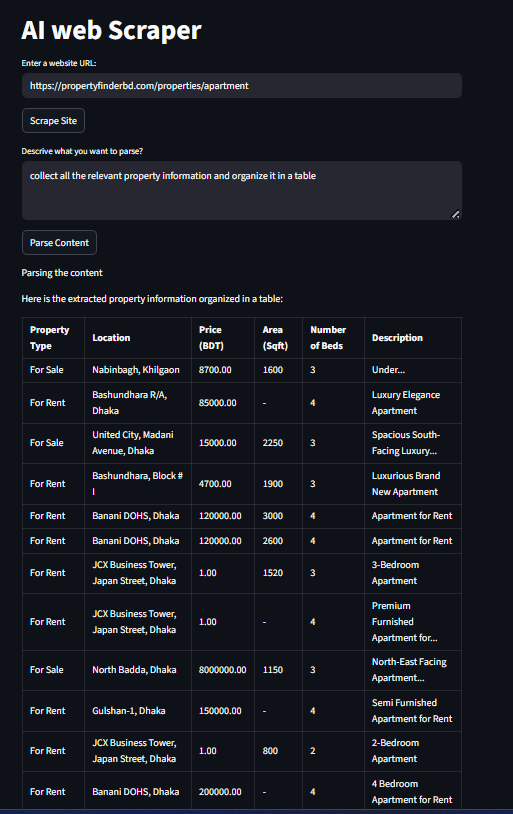

# AI Web Scraper (LLM-Powered)

A Streamlit app that:
1) Scrapes a webpage using Selenium  
2) Cleans the page body text  
3) Uses a local LLM (Ollama + Llama 3) to extract only the information you describe

This is useful for turning messy webpages (like listings pages) into structured output.

## Demo Output



## How it works

- **Scrape**: Selenium opens the URL and reads the rendered HTML.
- **Extract & clean**: It keeps the `<body>` section, removes scripts/styles, and converts it to readable text.
- **Chunking**: The cleaned text is split into chunks (default: 6000 chars) to fit LLM context limits.
- **Parse with LLM**: Each chunk is sent to Ollama (Llama 3). The outputs are concatenated and displayed in the Streamlit UI.

## Tech stack

- Streamlit (UI)
- Selenium + ChromeDriver (scraping dynamic pages)
- BeautifulSoup (HTML parsing + cleanup)
- LangChain + Ollama (local LLM extraction)

## Prerequisites

### 1) Python
Python 3.9+ recommended.

### 2) Ollama + Llama 3 model
Install Ollama and pull the model:

```bash
ollama pull llama3
